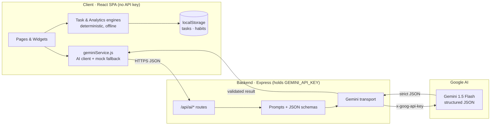
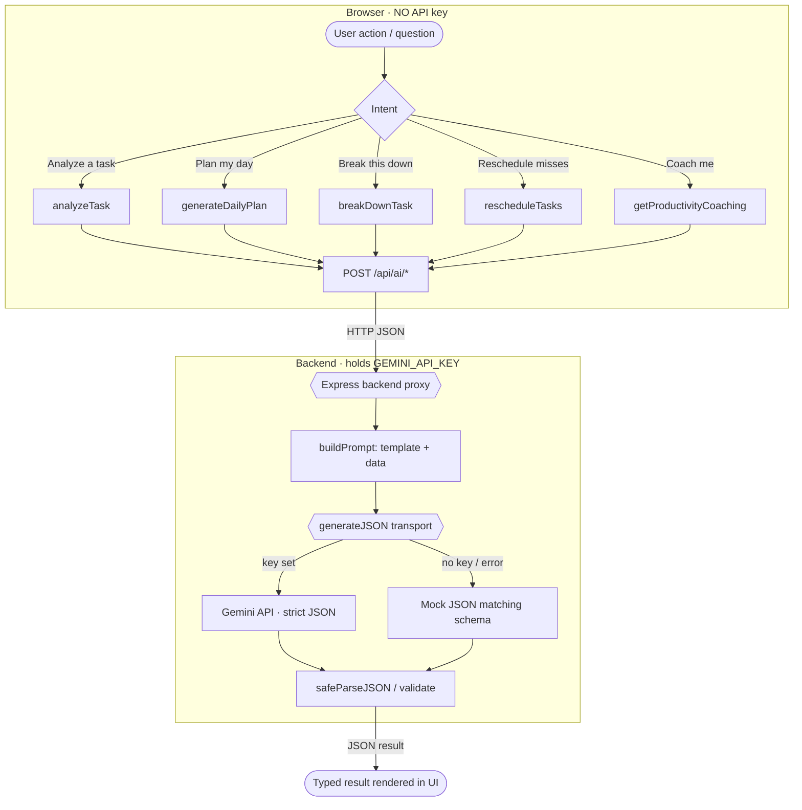

# Deadline Guardian AI

> Your AI-powered deadline and productivity command center — never miss a deadline again.

[](https://react.dev)
[](https://vitejs.dev)
[](https://tailwindcss.com)
[](https://www.framer.com/motion/)
[](https://ai.google.dev)
[](#current-day-1-progress)

**Deadline Guardian AI** is a productivity dashboard that acts like a personal chief-of-staff.
It scores every task by urgency and importance, flags deadlines at risk of slipping, builds a
time-blocked daily plan, tracks habits, and surfaces an AI Productivity Copilot that can break
work down, reschedule misses, and coach you — all powered by **Google Gemini**.

### Live Demo

> **[Launch the live demo →](https://REPLACE_ME-your-deployment-url.web.app)** <!-- REPLACE_ME: paste your deployed URL (Firebase Hosting / Cloud Run / Render). Until then, run it locally — see Setup Instructions. -->
>
> Prefer to run it yourself? It's two commands — jump to **[Setup Instructions](#setup-instructions)**.

---

## Table of Contents

- [Overview](#overview)
- [Live Demo](#live-demo)
- [Screenshots](#screenshots)
- [Problem Statement](#problem-statement)
- [Solution Summary](#solution-summary)
- [Key Features](#key-features)
- [Architecture](#architecture)
- [AI-Powered Features](#ai-powered-features)
- [Tech Stack](#tech-stack)
- [Google Technologies (Planned / Used)](#google-technologies-planned--used)
- [AI Agent Workflow](#ai-agent-workflow)
- [Secure Backend](#secure-backend)
- [Current Day 1 Progress](#current-day-1-progress)
- [Setup Instructions](#setup-instructions)
- [Deployment](#deployment)
- [Demo Flow](#demo-flow)
- [Folder Structure](#folder-structure)
- [Future Roadmap](#future-roadmap)
- [License](#license)

---

## Overview

Students and builders juggle hackathons, assignments, interviews, bills, and habits — across a
dozen apps that all shout equally loud. **Deadline Guardian AI** unifies them into a single,
calm command center that answers one question at any moment: _"What should I do right now?"_

The app pairs a fast, deterministic **priority engine** (works offline, instantly) with an
**AI agent layer** (Google Gemini) that reasons about context, plans your day, and explains its
recommendations in plain language.

## Screenshots

> Every screen ships with realistic demo data, so the app looks "live" the moment you open it.

### The Dashboard — your AI command center

One calm view that answers *"What should I do right now?"* — the AI Daily Brief, today's
time-blocked schedule, a deadline-risk radar, your productivity score, ranked priority tasks,
habit streaks, and personalized AI recommendations.


### Tasks · Planner · Habits · Copilot

<table>
  <tr>
    <td width="50%" valign="top">
      
      <p align="center"><sub><b>Tasks</b> — ranked 0–100, risk-tagged, with AI reasons</sub></p>
    </td>
    <td width="50%" valign="top">
      
      <p align="center"><sub><b>AI Planner</b> — a focus-first, time-blocked day</sub></p>
    </td>
  </tr>
  <tr>
    <td width="50%" valign="top">
      
      <p align="center"><sub><b>Habits</b> — streaks &amp; daily goals</sub></p>
    </td>
    <td width="50%" valign="top">
      
      <p align="center"><sub><b>Copilot</b> — a context-aware AI chat</sub></p>
    </td>
  </tr>
</table>

### Insights — see how you actually work

Completion rate, missed-task ratio, average delay, your most-productive time of day, AI coaching
(strengths / focus areas / recommendations), a 7-day weekly report, and live Recharts trends.


### Landing


## Problem Statement

Most to-do apps are passive lists. They:

- Treat every task as equally important and show no sense of **risk**.
- Force the user to manually decide **what to do next** and **when**.
- Don't **re-plan** when life happens and a task is missed.
- Offer no **coaching** or feedback loop to build better habits.

The result is missed deadlines, last-minute crunches, and decision fatigue.

## Solution Summary

Deadline Guardian AI flips the to-do list into an **active guardian**:

1. **Scores & ranks** every task using a deadline-urgency + importance + effort model.
2. **Detects deadline risk** early (`Critical → High → Attention → Safe`) so nothing slips.
3. **Plans your day** into focus-optimized time blocks with the hardest work scheduled first.
4. **Re-plans automatically** when tasks are missed, fitting them into open slots.
5. **Coaches you** with an AI Productivity Copilot, task breakdowns, and habit streaks.

A clean **task engine** provides instant, offline results, while the **Gemini agent layer**
adds natural-language reasoning. The app is fully functional today on realistic mock data and
is wired so that turning on real AI is a one-function change.

## Key Features

| Feature | Description |
| --- | --- |
| **Daily Brief** | An at-a-glance AI summary of your day, highlights, and the one thing that matters most. |
| **Priority Tasks** | Tasks ranked 0–100 by a deadline + importance + effort scoring engine. |
| **Deadline Risk Radar** | Color-coded risk badges (Critical / High / Attention / Safe) that warn before a deadline slips. |
| **Productivity Score** | A single radial-gauge metric that tracks momentum, with a 7-day trend. |
| **AI Planner** | A time-blocked daily schedule (8:00–24:00) generated around your highest-priority work. |
| **Auto-Replan** | One click reschedules missed / at-risk tasks into the next open slots. |
| **Habit Tracker** | Streak-based habit tracking with weekly heatmaps and daily goals. |
| **Insights** | Personalized productivity analysis — completion rate, missed-task ratio, average delay, most productive time of day & most ignored category, human-readable insight cards, AI coaching (strengths/focus areas/recommendations), a 7-day Weekly Report, and supporting Recharts trends. |
| **Productivity Copilot** | A context-aware chat assistant that reasons over your live tasks, habits, schedule, and stats — answering "what now?", feasibility, time-boxing, energy, and "what am I doing wrong?" with structured cards, typing animation, and voice input. |
| **Responsive UI** | A polished, glassy interface that works from 390px mobile to 1440px desktop. |

## Architecture

Deadline Guardian AI is built in three layers, separated by a **hard security boundary** so the
Gemini API key never reaches the browser.



**How to read it**

- **Client (React SPA).** Everything the user sees. Two *deterministic* engines — the **task
  engine** (priority + risk) and the **analytics engine** (insights) — run instantly and fully
  offline, and tasks/habits persist in `localStorage`. The client holds **no API key**; for AI it
  calls our own backend.
- **Backend (Express).** The only place that knows the Gemini key. It owns the **prompt
  templates** and **response schemas**, calls Gemini server-side, validates the JSON, and returns a
  clean result — or a **mock** in the same shape if the key is missing or Gemini errors.
- **Google AI (Gemini 1.5 Flash).** Does the natural-language reasoning and returns **strict
  JSON** (`responseMimeType: application/json`) so the output is directly renderable.

Every cross-boundary hop is **HTTPS JSON**, and the key only ever travels on the server-to-Google
request — never to the browser. Because each layer degrades gracefully, the app stays fully usable
with no key and even with no network.

## AI-Powered Features

Six specialized AI agents share one secure flow (**React → Express → Gemini**). Each has a
deterministic mock fallback, so the feature always works — with or without a key.

| Agent | What it does for you |
| --- | --- |
| **Task Analyst** | Reads a new task and returns a 0–100 priority, a risk level, an effort estimate, a plain-English reason, and suggested subtasks. |
| **Daily Planner** | Turns your open tasks into a non-overlapping, focus-first schedule with the hardest work placed in your peak hours. |
| **Task Breakdown** | Explodes a big, intimidating task into an ordered, effort-estimated checklist you can actually start. |
| **Rescheduler** | When you fall behind, it slots missed / at-risk tasks into the next open blocks — no manual shuffling. |
| **Productivity Coach** | Reviews how you actually worked and returns tone-coded strengths, focus areas, and recommendations. |
| **Context-Aware Copilot** | A chat assistant grounded in your *live* tasks, habits, schedule, and stats (plus the last 5 turns) that answers "what now?", feasibility, and "what am I doing wrong?". |

> Each response is **strict JSON** validated against a schema, so the UI renders structured cards
> instead of raw text — and the deterministic mock keeps the demo flawless offline.

## Tech Stack

| Layer | Technology |
| --- | --- |
| **Framework** | React 18 (SPA) |
| **Build Tool** | Vite 5 |
| **Routing** | React Router 6 |
| **Styling** | Tailwind CSS 3 + PostCSS + Autoprefixer |
| **Animation** | Framer Motion 11 |
| **Charts** | Recharts 2 |
| **Icons** | lucide-react |
| **Backend** | Node.js + Express (secure Gemini proxy) |
| **AI** | Google Gemini API (`gemini-2.5-flash`), called only from the backend |
| **Voice** | Web Speech API (browser-native) |
| **Persistence** | Browser `localStorage` (mock-data fallback) |
| **State** | React Context + hooks |

## Google Technologies (Planned / Used)

| Technology | Role | Status |
| --- | --- | --- |
| **Google Gemini API** (`gemini-2.5-flash`) | Core AI reasoning — task analysis, planning, breakdown, rescheduling, coaching. | Live via secure backend proxy |
| **Google AI Studio** | API key provisioning and prompt prototyping. | In use for keys |
| **Gemini Structured Output** | `responseMimeType: application/json` for strict, parseable JSON. | In use (server-side) |
| **Google Calendar API** | Two-way sync of generated time blocks. | Planned |
| **Firebase Hosting** | Static deployment of the production build. | Planned |

> SECURITY_NOTE: The Gemini key lives **only on the backend** (`process.env.GEMINI_API_KEY`).
> The browser never receives it — the React app calls our own `/api/ai/*` endpoints, and the
> Express server attaches the key server-side via the `x-goog-api-key` header over HTTPS. The key
> is never hardcoded, logged, committed, or shipped in the frontend bundle.

## AI Agent Workflow

The AI layer is split across a **secure boundary** so the API key never reaches the browser:

- **Frontend** [`src/services/geminiService.js`](src/services/geminiService.js) builds a
  deterministic mock, then POSTs the request to our own backend (`/api/ai/*`). It holds **no key**.
- **Backend** [`server/services/geminiServerService.js`](server/services/geminiServerService.js)
  owns the **prompt templates**, **response schemas**, and the single Gemini transport. It reads
  the key from `process.env.GEMINI_API_KEY` and calls Gemini server-side.

Six specialized agents share one flow:  **React Frontend → Backend API Route → Gemini API**.



| Agent | Backend Endpoint | Returns |
| --- | --- | --- |
| **Task Analyst** | `POST /api/ai/analyze-task` | priority score, risk level, effort, reason, subtasks |
| **Daily Planner** | `POST /api/ai/generate-daily-plan` | non-overlapping time blocks + focus hours |
| **Task Breakdown** | `POST /api/ai/break-down-task` | ordered, effort-estimated checklist |
| **Rescheduler** | `POST /api/ai/reschedule-tasks` | new slots for missed / at-risk tasks |
| **Productivity Coach** | `POST /api/ai/productivity-coach` | review + tone-coded recommendations |
| **Context-Aware Copilot** | `POST /api/ai/assistant-chat` | intent-aware reply text grounded in live tasks, habits, schedule, stats + last 5 turns of memory (cards built client-side) |

The backend instructs Gemini to **return strict JSON only** (no markdown, no code fences) and
embeds a sample schema as a one-shot example, so responses are predictable and directly renderable.
The frontend always keeps a deterministic **mock fallback**, so the UI works even with no key or
no backend reachable. The current AI mode is reported by `GET /api/ai/status` (which reflects
whether the *last real Gemini call actually succeeded*, not merely whether a key is present), and a
one-shot connectivity probe is available at `GET /api/ai/test`. Both are shown in the in-app badge.

## Secure Backend

The backend exists for one reason: **keep the Gemini API key off the client** and put a small,
hardened surface in front of Google's API.

- **Key stays server-side.** Read only as `process.env.GEMINI_API_KEY` inside Express and attached
  on the server-to-Google request (`x-goog-api-key`, over HTTPS). It is **never** hardcoded,
  logged, committed, or bundled into the frontend. `.env` is git-ignored; only `.env.example` ships.
- **Tight CORS allow-list.** Only known origins (local dev ports + a configurable `CLIENT_ORIGIN`)
  may call the API — no wildcard `*`.
- **Bounded input.** Bodies are capped (`express.json({ limit: '100kb' })`) and every endpoint
  validates it received a proper object before doing any work.
- **No leaky errors.** A central handler returns clean JSON — never a stack trace, the key, or
  internal details. Logs report only the AI *mode*, never secrets.
- **Fails safe.** If the key is absent or Gemini is unreachable, every endpoint returns a
  deterministic **mock** in the same schema, so the app never crashes or hangs on the network.
- **Status, not secrets.** `GET /api/ai/status` exposes only `mode` (live/mock), `configured`,
  the active `model`, and a safe `lastError` — never the key. `GET /api/ai/test` runs one tiny
  live call to verify connectivity and returns `{ ok, mode, model, response | error }`.

> SECURITY_NOTE: In production, inject `GEMINI_API_KEY` through your host's secret manager (e.g.
> Google Cloud Run variables or Secret Manager) rather than a file on disk.

## Current Day 1 Progress

- [x] Project scaffolding — React + Vite + Tailwind + React Router.
- [x] Seven pages — Landing, Dashboard, Tasks, Planner, Habits, Insights, Assistant.
- [x] Deterministic **task engine** (priority scoring + risk classification).
- [x] Bento-grid dashboard with 9 widgets (Daily Brief, Risk, Score, Habits, etc.).
- [x] **AI agent layer** — 6 agents now served by a secure Express backend (prompts + schemas server-side).
- [x] Floating **Productivity Copilot** with quick actions and voice input.
- [x] **Context-aware Copilot** — reasons over live tasks, habits, schedule & stats; renders structured cards (focus, feasibility, time breakdown, insights) with last-5-turn memory and typing animation.
- [x] Habit tracking, planner timeline, and Recharts insights.
- [x] Demo-quality polish — glassy sidebar, animations, empty/loading states.
- [x] Fully **responsive** (mobile → 1440px desktop) and passing production build.
- [x] **Live Gemini API calls via a secure backend proxy** (key stays server-side; mock fallback when absent).

## Setup Instructions

### Prerequisites

- **Node.js** 18+ and **npm** 9+

### Install & run

```bash
# 1. Install dependencies
npm install

# 2. Start the frontend (Vite) and backend (Express) together
npm run dev
```

Then open **http://localhost:5173**. The frontend proxies all `/api` requests to the backend
running on port **3001**, so you only ever open the one URL.

### Available scripts

| Command | Description |
| --- | --- |
| `npm run dev` | Start the **frontend + backend together** (via `concurrently`). |
| `npm run dev:client` | Start only the Vite dev server (frontend). |
| `npm run dev:server` | Start only the Express API server (backend). |
| `npm run build` | Produce an optimized production build in `dist/`. |
| `npm run preview` | Preview the production build locally. |
| `npm start` | Run the backend API server (production). |
| `npm run lint` | Run ESLint across the project. |

### AI configuration (optional)

The app runs fully in an **offline Mock AI Mode** out of the box — no key required. To enable
real Gemini responses, give the **backend** a key (it is never exposed to the browser):

```bash
# Copy the template (this file is git-ignored)
cp .env.example .env
```

```bash
# .env  (read only by the backend server)
GEMINI_API_KEY=your_google_ai_studio_key_here
GEMINI_MODEL=gemini-2.5-flash-lite
PORT=3001
```

Get a free key from **[Google AI Studio](https://aistudio.google.com/app/apikey)**, then restart
`npm run dev`. The in-app badge switches to **"Gemini Live via Secure Backend"**. `GEMINI_MODEL`
is optional — it defaults to `gemini-2.5-flash-lite` (the retired `gemini-1.5-flash` returns 404).

To confirm the live connection, hit **`GET http://localhost:3001/api/ai/test`** — it makes one
tiny Gemini call and returns `{ "ok": true, "mode": "live", "model": "...", "response": ... }`
on success, or a safe `{ "ok": false, "mode": "mock", "error": "..." }` (HTTP 503) if it fails.

> SECURITY_NOTE: The key is read only by the Express backend via `process.env.GEMINI_API_KEY` and
> is **never** shipped to the browser. `.env` / `.env.local` are git-ignored — never hardcode or
> commit keys. In production, inject `GEMINI_API_KEY` through your host's secret manager (e.g.
> Google Cloud Run env vars or Secret Manager) instead of a committed file.

## Deployment

Deadline Guardian AI deploys as **one full-stack service**: the Express backend serves the built
React frontend from `dist/` **and** handles the `/api/*` routes on the same origin. There is no
separate frontend host and **no Vite dev server in production**.

### Google Cloud Run / AI Studio

1. **Add server-side environment variables** (the key stays on the server, never in the browser):

   | Variable | Value |
   | --- | --- |
   | `GEMINI_API_KEY` | your Google AI Studio key |
   | `GEMINI_MODEL` | `gemini-2.5-flash-lite` |

2. **Build command:** `npm run build` — produces the static frontend in `dist/`.
3. **Start command:** `npm start` — Express serves `dist/` **and** the `/api` routes.

No code changes are needed after upload. Cloud Run injects its own `PORT`; the server respects
`process.env.PORT` (defaulting to `8080`).

> The Gemini API key is read only by the Express backend via `process.env.GEMINI_API_KEY` and is
> **never** exposed in frontend code. Inject it through Cloud Run env vars or Secret Manager.

### Verify a deployment

```bash
npm install
npm run build
npm start
```

Then check:

- **`http://localhost:8080`** — the React app loads (no Vite dev logs).
- **`http://localhost:8080/health`** — `{ "ok": true, "service": "Deadline Guardian AI", "mode": "production-ready" }`.
- **`http://localhost:8080/api/ai/status`** — reports `live` (with a key) or `mock` (without).
- Deep links like `/dashboard`, `/assistant`, `/planner` load and survive a refresh (no 404).

> Optional: if you instead run the frontend on a separate origin, set `CLIENT_ORIGIN` to that
> origin so CORS allows it. The single-service model above needs no CORS configuration.

## Demo Flow

A 60–90 second walkthrough that shows the whole product, end to end:

1. **Open the Dashboard.** The **AI Daily Brief** sums up the day and calls out the single task
   that matters most; the **Deadline Risk** radar shows what's about to slip.
2. **Click "Plan My Day."** The **AI Planner** builds a time-blocked schedule, hardest work first —
   then mark a task missed and hit **Replan** to watch it reflow into the next open slot.
3. **Open Tasks.** Every task is ranked **0–100** with a color-coded risk badge and a one-line AI
   reason. Expand one to reveal its **AI breakdown** checklist.
4. **Open Habits.** Daily habits with **streaks** and weekly progress — tick one and watch the
   streak update live.
5. **Open Insights.** Completion rate, average delay, most-productive hours, **AI coaching**, and a
   7-day weekly report with live charts.
6. **Ask the Copilot.** Open the floating **Productivity Copilot** and ask *"What should I do right
   now?"* — it answers from your live tasks, habits, and schedule and renders a structured action card.

> Tip: everything runs on built-in demo data, so the demo works offline with zero setup — and
> upgrades to live Gemini responses the moment a key is present.

## Folder Structure

```text
deadline-guardian-ai/
├─ public/                     # Static assets
├─ src/
│  ├─ components/
│  │  ├─ assistant/            # FloatingAssistant, AssistantPanel, AssistantMessage, TypewriterText, AssistantResponseCards
│  │  ├─ common/               # Badge, Button, Card, MicButton, VoiceOverlay, Toast, ...
│  │  ├─ dashboard/            # 9 bento widgets (Brief, Risk, Score, Habits, ...)
│  │  ├─ layout/               # AppShell, Sidebar, Topbar, BottomNav, Logo, GradientOrbs
│  │  └─ tasks/                # TaskCard
│  ├─ context/                 # AppContext (tasks/habits) + VoiceContext (voice session)
│  ├─ data/                    # mockData.js — Day 1 demo content
│  ├─ lib/                     # cn (classnames), motion (animation variants)
│  ├─ pages/                   # Landing, Dashboard, Tasks, Planner, Habits, Insights, Assistant
│  ├─ services/
│  │  ├─ geminiService.js      # Frontend AI client — calls backend /api/ai/*, mock fallback
│  │  ├─ assistantEngine.js    # Copilot router — structured intents + context-aware chat
│  │  ├─ copilotBrain.js       # Context-aware reasoning — builds intent + reply + cards from live data
│  │  ├─ voiceService.js       # Web Speech API wrapper (start/stop/onResult/onError)
│  │  ├─ voiceCommands.js      # Voice intent parser + command executor
│  │  ├─ storageService.js     # localStorage persistence
│  │  ├─ productivityAnalytics.js # Deterministic insights engine — metrics, patterns, weekly report
│  │  └─ taskEngine.js         # Priority scoring + risk classification
│  ├─ utils/                   # dateUtils, uiMeta (risk/status/block styling)
│  ├─ App.jsx                  # Routes
│  ├─ main.jsx                 # Entry + Router
│  └─ index.css                # Tailwind layers + design tokens
├─ server/                     # Secure backend (Express) — holds the Gemini key
│  ├─ index.js                 # Express app: CORS, JSON limits, mounts /api/ai
│  ├─ routes/
│  │  └─ aiRoutes.js           # 6 AI endpoints + GET /status
│  ├─ services/
│  │  └─ geminiServerService.js # Prompts, schemas + Gemini transport (server-side)
│  └─ utils/
│     └─ safeJson.js           # Tolerant JSON parsing helpers
├─ .env.example                # Backend env template (GEMINI_API_KEY, PORT)
├─ tailwind.config.js
├─ vite.config.js
└─ package.json
```

## Future Roadmap

### Phase 2 — Gemini Integration
- [x] **Secure backend proxy** so the API key never ships to the browser.
- [x] Live Gemini call inside the backend transport using structured JSON output.
- [x] **Context-aware Copilot** — full app context + conversation memory sent to Gemini, structured-card responses.
- [ ] Stream assistant replies token-by-token in the Copilot chat.

### Phase 3 — Smart Scheduling
- Two-way **Google Calendar** sync for generated time blocks.
- Energy-aware planning (deep work in peak hours, admin in troughs).
- Conflict detection and automatic buffer/break insertion.

### Phase 4 — Voice Assistant
- Full conversational voice loop ("Plan my day", "What's next?").
- Gemini-powered intent routing to the right agent.
- Spoken daily brief and proactive deadline nudges.

### Phase 5 — Deployment & Scale
- **Firebase Hosting** for the production build with CI/CD.
- User auth and cloud sync (Firebase Auth + Firestore).
- Push notifications for at-risk deadlines.
- PWA / offline-first support.

## License

Released under the **MIT License** — built for hackathon demonstration.
